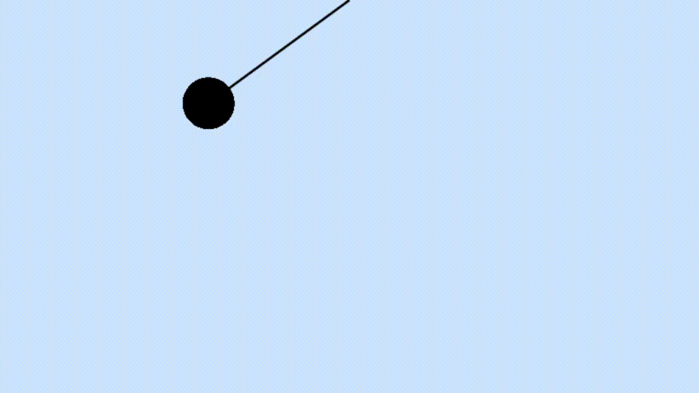

# 🕰️ Simulação de Pêndulo em Rust

Este projeto é uma simulação visual de um pêndulo simples implementado em **Rust**, utilizando a biblioteca gráfica [Speedy2D](https://github.com/QuantumBadger/Speedy2D).

---

## 🚀 Tecnologias Utilizadas

- [Rust](https://www.rust-lang.org/)
- [Speedy2D](https://github.com/QuantumBadger/Speedy2D) — para renderização gráfica 2D

---

## 🎯 Objetivo

A proposta deste projeto é simular o movimento de um pêndulo utilizando conceitos básicos de física (como aceleração angular, velocidade angular e gravidade), representando seu movimento em uma janela gráfica com uma animação contínua.

---

## 🧠 Como funciona?

O pêndulo é modelado com os seguintes elementos:

- `origin`: ponto de origem (fixo) do pêndulo.
- `angle`: ângulo atual do pêndulo.
- `angular_velocity`: velocidade com que o ângulo muda.
- `angular_acceleration`: aceleração resultante da gravidade.
- `r`: comprimento do fio do pêndulo.
- `position`: posição calculada da massa em movimento.

O movimento é atualizado com base na fórmula física:

angular_acceleration = -g * sin(angle) / r

Esse cálculo é repetido a cada frame, criando a ilusão do movimento oscilatório do pêndulo.

---

## 📷 Demonstração



---

## ▶️ Como Executar

1. Clone o repositório:

```bash
git clone https://github.com/Marcones-san/pendulo-rust.git
cd projeto-pendulo-rust
cargo run

Obs: Se der erro após esse comando, pode ser alguma função do antivirus, então use o comando "cargo run --release".
